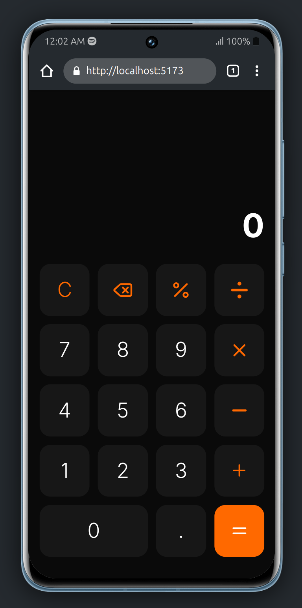

# React Calculator

A simple calculator web application built using **React and Tailwind CSS**.


## 📸 Screenshot
[]()

## 🚀 Features
- Basic arithmetic operations (+, -, ×, ÷)
- Percentage calculation
- Clear and delete functionality
- Responsive design
- Dark mode aesthetic

## 🛠️ Tech Stack
- **React** - Frontend framework
- **Tailwind CSS** - Styling
- **Bun** - Package manager and runtime

## 📦 Installation

## Install Using Bun

### Prerequisites
Make sure you have **Bun** installed on your system. If not, install it using:
```sh
curl -fsSL https://bun.sh/install | bash
```

### Check Bun Version
```sh
bun --version
```

### Clone the Repository
```sh
git clone https://github.com/SoumyadipDutta1004/react-calculator.git
cd react-calculator
```

### Install Dependencies
```sh
bun install
```

### Run the Application
```sh
bun run dev
```

Now, open your browser and navigate to `http://localhost:5173` to use the calculator.

## Install Using NPM

### Check NPM Version
```sh
npm --version
```

### Clone the Repository
```sh
git clone https://github.com/SoumyadipDutta1004/react-calculator.git
cd react-calculator
```

### Install Dependencies
```sh
npm install
```

### Run the Application
```sh
npm run dev
```

Now, open your browser and navigate to `http://localhost:5173` to use the calculator.

---
Made with ❤️ by **Soumyadip Dutta**

